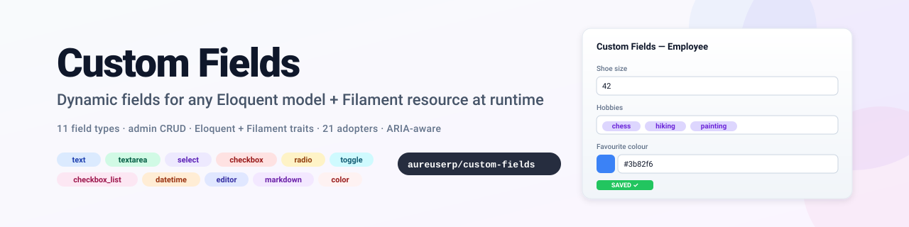

# Custom Fields for Filament v5

[](https://packagist.org/packages/aureuserp/custom-fields)
[](LICENSE.md)

<p align="center">
    <picture>
        <source media="(prefers-color-scheme: dark)" srcset="art/banner-dark.svg">
        
    </picture>
</p>

Let your end-users add **dynamic fields** to any Eloquent model + Filament resource **at runtime**, without writing a single migration. Ships an admin CRUD for managing field definitions, an Eloquent trait that auto-merges the new columns into your model's fillable/casts, a Filament resource trait with five merge helpers that inject fields into forms, tables, filters, infolists, and a runtime schema manager that creates the underlying DB columns for you.

---

## Table of contents

- [Features](#features)
- [Requirements](#requirements)
- [Installation](#installation)
- [Quick start](#quick-start)
- [API reference](#api-reference)
  - [Eloquent trait](#eloquent-trait)
  - [Filament resource trait](#filament-resource-trait)
  - [Components](#components)
  - [Column manager](#column-manager)
- [Enums](#enums)
- [Star rating field](#star-rating-field)
- [Storage modes](#storage-modes)
- [Real-world example](#real-world-example)
- [Translations](#translations)
- [Publishing resources](#publishing-resources)
- [Testing](#testing)
- [Troubleshooting](#troubleshooting)
- [Security](#security)
- [Contributing](#contributing)
- [Credits](#credits)
- [License](#license)

---

## Features

- **Eloquent trait** (`HasCustomFields`) — drop onto any model; custom field codes auto-merge into `$fillable` and `$casts` at runtime
- **Filament resource trait** — 5 one-line merge helpers: `mergeCustomFormFields`, `mergeCustomTableColumns`, `mergeCustomTableFilters`, `mergeCustomTableQueryBuilderConstraints`, `mergeCustomInfolistEntries`
- **Admin CRUD** (`/admin/custom-fields`) — create, edit, sort, soft-delete dynamic fields per resource, with full validation / formatting settings
- **12 field types** via `FieldType` enum — Text, Textarea, Select, Checkbox, Radio, Toggle, CheckboxList, DateTime, Editor, Markdown, ColorPicker, StarRating
- **8 text input types** via `InputType` enum — Text, Email, Numeric, Integer, Password, Tel, Url, Color
- **Star rating field** — 0–10 scale with half-star precision, paired numeric input + clickable stars, scaled-integer storage (`value × 100`)
- **Two storage modes** — `Schema` (dedicated DB column per field, default) or `JSON` (value stored as key in an existing JSON column); see [Storage modes](#storage-modes)
- **Schema manager** (`CustomFieldsColumnManager`) — programmatically add / drop DB columns when fields are created or deleted (no-op in JSON mode)
- **Table integration** — the defined fields automatically surface as `CustomColumns` (if `use_in_table=true`) and `CustomFilters`
- **Spatie-sortable** — drag-to-reorder fields with `order_column_name=sort`
- **Soft deletes** — recover deleted field definitions
- **Policy + permissions** — Filament Shield compatible, with `view_any_field_field`, `create_field_field` etc.
- **Translations** — `en`, `ar`, and `ru` shipped (navigation + form labels + validation names + setting names)
- **Pest test suite** — architecture + model + policy + trait + components + enums + star rating + translation parity + JSON mode (121+ tests)

---

## Requirements

- PHP 8.2+
- Laravel 11+
- Filament v5+
- `spatie/eloquent-sortable` v4 (already a Filament dependency)

---

## Installation

```bash
composer require aureuserp/custom-fields
```

The service provider is auto-discovered. The migration is registered via Spatie's package-tools and run on `php artisan migrate`.

```bash
php artisan migrate
```

> [!NOTE]
> **Migrating from `webkul/fields`**: the `custom_fields` table migration keeps its original timestamp filename, so existing installations will see it already applied — no duplicate-table errors, no re-run.

---

## Quick start

### 1. Mark your model

```php
use Illuminate\Database\Eloquent\Model;
use Webkul\CustomFields\Concerns\HasCustomFields;

class Employee extends Model
{
    use HasCustomFields;
}
```

Any custom field code defined against `Webkul\Employee\Models\Employee` is now mass-assignable and properly cast.

### 2. Extend your Filament resource

```php
use Filament\Resources\Resource;
use Filament\Schemas\Schema;
use Webkul\CustomFields\Filament\Concerns\HasCustomFields;

class EmployeeResource extends Resource
{
    use HasCustomFields;

    public static function form(Schema $schema): Schema
    {
        return $schema->components(
            static::mergeCustomFormFields([
                // your base fields
            ])
        );
    }

    public static function table(Table $table): Table
    {
        return $table
            ->columns(static::mergeCustomTableColumns([ /* base */ ]))
            ->filters(static::mergeCustomTableFilters([ /* base */ ]));
    }
}
```

### 3. Define fields in the admin CRUD

Visit **`/admin/custom-fields`** → **New field** → pick a resource → pick a field type → configure options/validations → save.

The field now appears in the resource's form, table, filters, and infolist automatically.

---

## API reference

### Eloquent trait

`Webkul\CustomFields\Concerns\HasCustomFields`

Boots three lifecycle listeners (`retrieved`, `creating`, `updating`) that call `loadCustomFields()`:

- **`loadCustomFields()`** — queries `Field::where('customizable_type', get_class($this))`, merges every field's `code` into `$fillable` and applies type-appropriate casts.
- **`mergeFillable(array $attributes)`** — public helper exposed for ad-hoc merging.
- **`mergeCasts($attributes)`** — public helper; accepts either an array (passes through to parent) or a Collection of Field records.
- **`getCustomFields()`** (protected) — override this if you want to scope the query (e.g. to a specific tenant).

Type-to-cast mapping:

| Field type | Cast |
|---|---|
| `select` (multiselect) | `array` |
| `select` (single) | `string` |
| `checkbox`, `toggle` | `boolean` |
| `checkbox_list` | `array` |
| everything else | `string` |

### Filament resource trait

`Webkul\CustomFields\Filament\Concerns\HasCustomFields`

Five static helpers — each accepts a base array + optional include/exclude lists and returns `base + custom`:

```php
static::mergeCustomFormFields(array $base, array $include = [], array $exclude = []): array
static::mergeCustomTableColumns(array $base, array $include = [], array $exclude = []): array
static::mergeCustomTableFilters(array $base, array $include = [], array $exclude = []): array
static::mergeCustomTableQueryBuilderConstraints(array $base, array $include = [], array $exclude = []): array
static::mergeCustomInfolistEntries(array $base, array $include = [], array $exclude = []): array
```

`include=[]` means "all fields"; a non-empty list whitelists field codes. `exclude` blacklists field codes.

### Components

Each injector is also usable standalone:

```php
use Webkul\CustomFields\Filament\Forms\Components\CustomFields;
use Webkul\CustomFields\Filament\Infolists\Components\CustomEntries;
use Webkul\CustomFields\Filament\Tables\Columns\CustomColumns;
use Webkul\CustomFields\Filament\Tables\Filters\CustomFilters;

CustomFields::make(MyResource::class)
    ->include(['hobbies'])
    ->exclude(['internal_notes'])
    ->getSchema();
```

### Column manager

`Webkul\CustomFields\CustomFieldsColumnManager`

Three static methods called on Field model lifecycle (create/update/delete):

- `createColumn(Field $field)` — adds the column to the customisable model's table with the appropriate DB type
- `updateColumn(Field $field)` — creates the column if missing (for rename/resurrect scenarios)
- `deleteColumn(Field $field)` — drops the column

The DB type mapping uses `getColumnType()` which routes via `FieldType::tryFrom($field->type)`:

| Field type | DB column type |
|---|---|
| `text` | `string` / `integer` / `decimal` (based on `input_type`) |
| `textarea`, `editor`, `markdown` | `text` |
| `select` (multiselect) | `json` |
| `select` (single), `radio`, `color` | `string` |
| `checkbox`, `toggle` | `boolean` |
| `checkbox_list` | `json` |
| `datetime` | `datetime` |
| `star_rating` | `integer` (stored as display value × base, default base = 100) |

---

## Enums

| Enum | Cases → values | Default |
|---|---|---|
| `FieldType` | `Text='text'`, `Textarea='textarea'`, `Select='select'`, `Checkbox='checkbox'`, `Radio='radio'`, `Toggle='toggle'`, `CheckboxList='checkbox_list'`, `DateTime='datetime'`, `Editor='editor'`, `Markdown='markdown'`, `ColorPicker='color'`, `StarRating='star_rating'` | `FieldType::Text` |
| `InputType` | `Text`, `Email`, `Numeric`, `Integer`, `Password`, `Tel`, `Url`, `Color` | `InputType::Text` |

Both enums expose a `default()` static for symbolic-constant fallbacks:

```php
use Webkul\CustomFields\Enums\FieldType;
use Webkul\CustomFields\Enums\InputType;

$type = FieldType::tryFrom($raw) ?? FieldType::default();
```

---

## Star rating field

`Webkul\CustomFields\Filament\Forms\Components\StarRating` (plus the matching `StarRatingEntry` and `StarRatingColumn`) ships with the plugin and is selected automatically when an admin picks **Star Rating** in the CRUD.

Default behaviour:

- 5 half-fillable stars representing a 0–10 display value, step 0.5.
- Paired UI: click any half-star **or** type the number directly into the adjacent input; the two stay in sync. Out-of-range or off-step input snaps to the nearest valid value on blur.
- Clearable — blanking the input (or clicking the active half-star a second time) sets the value to `null`.

Storage strategy — **scaled integer**:

- The DB column is a plain `integer`, not a float or decimal. The display value is multiplied by the component's `base` (default `100`) before persisting, and divided back on hydration. `7.5` display → `750` stored → `7.5` display.
- This keeps equality / range queries exact (`where('score', 750)` finds the 7.5 rows), avoids IEEE-754 rounding, and serialises cleanly into JSON columns if the field ever lives alongside JSON data.
- If you need the raw display value outside Filament, divide by the base yourself:

```php
$displayScore = $employee->score === null ? null : $employee->score / 100;
```

Range filter (admin list table):

- The plugin registers two numeric inputs (**from** / **to**). Values are entered in display units (0–10); the filter multiplies them by the base when building the `where … between` clause.

QueryBuilder constraint:

- Surfaces the underlying integer column via `NumberConstraint`. Power users working in the Query Builder compare against the stored integer (i.e. enter `750` to mean `7.5`). The friendly range filter above is the recommended UX for day-to-day filtering.

---

## Real-world example

Here's a full Employee resource adopting the trait. End-users can add a "hobbies" multiselect via the admin CRUD; the field flows through form, table, and infolist automatically.

```php
use Filament\Forms\Components\Select;
use Filament\Forms\Components\TextInput;
use Filament\Resources\Resource;
use Filament\Schemas\Schema;
use Filament\Tables\Columns\TextColumn;
use Filament\Tables\Table;
use Webkul\CustomFields\Filament\Concerns\HasCustomFields;
use Webkul\Employee\Models\Employee;

class EmployeeResource extends Resource
{
    use HasCustomFields;

    protected static ?string $model = Employee::class;

    public static function form(Schema $schema): Schema
    {
        return $schema->components(static::mergeCustomFormFields([
            TextInput::make('name')->required(),
            Select::make('department_id')->relationship('department', 'name'),
        ]));
    }

    public static function table(Table $table): Table
    {
        return $table
            ->columns(static::mergeCustomTableColumns([
                TextColumn::make('name'),
            ]))
            ->filters(static::mergeCustomTableFilters([]));
    }
}
```

And the Eloquent side:

```php
use Webkul\CustomFields\Concerns\HasCustomFields;

class Employee extends Model
{
    use HasCustomFields;

    protected $fillable = ['name', 'department_id'];
}

// After an admin defines a "hobbies" checkbox_list field:
$employee = Employee::create([
    'name' => 'Alice',
    'department_id' => 1,
    'hobbies' => ['chess', 'hiking'],  // ← custom field, automatically fillable + cast to array
]);

$employee->hobbies;  // ['chess', 'hiking']  ← automatically cast from JSON
```

---

## Storage modes

By default, creating a custom field **adds a real column** to the model's table (`Schema` mode). Since Filament v5 plugin version 1.x, a second mode is available: **JSON storage**.

### Schema mode (default)

Each field gets its own database column. The `CustomFieldsColumnManager` runs `ALTER TABLE` on create and `DROP COLUMN` on force-delete. This is the traditional approach — clean SQL queries, proper indexing, type safety.

### JSON mode

The field value is stored as a key inside an **existing JSON column** (e.g. `extra`). No `ALTER TABLE` is ever executed. The field `code` becomes the JSON key; the `storage_column` setting (default `extra`) is the column name.

**Model requirements:**

```php
class Article extends Model
{
    use HasCustomFields;

    protected $fillable = ['title', 'extra'];      // storage column must be fillable
    protected $casts    = ['extra' => 'array'];    // or AsArrayObject::class / 'json'
}
```

In the admin panel, choose **JSON (key in existing column)** in the *Storage Mode* select when creating a field, then set *JSON Column* (default `extra`).

### Key caveats

**Collision warning.** The plugin shows a warning if the field `code` matches a key already used in `extra` on existing records. Admin responsibility — the plugin does not block creation.

**fill() merge.** The `HasCustomFields` trait overrides `fill()` to merge JSON columns rather than replace them. This prevents custom-field saves from clobbering sibling keys (e.g. `extra.subtitle`) written by other code paths. If you bypass `fill()` (raw `$model->extra = [...]`), the merge does not apply.

**Mode immutability.** `storage` is locked after creation (UI: `disabledOn('edit')`). Switching modes after records are written would require a data migration — not in scope.

**Purge values action.** The action in the field list clears the field value from all records:
- Schema mode: `SET column = NULL WHERE column IS NOT NULL`
- JSON mode: `JSON_REMOVE(column, '$.key') WHERE JSON_CONTAINS_PATH(column, 'one', '$.key')` — **MySQL only**

Typed confirmation (`code` must be typed literally) + preflight count are shown before any changes.

**Filter/sort SQL.** Filters and QueryBuilder constraints use `extra->code` path syntax (arrow notation). StarRating comparisons use `CAST(JSON_UNQUOTE(JSON_EXTRACT(...)) AS SIGNED)` to avoid lexicographic comparison pitfalls.

**Non-MySQL.** JSON mode storage and purge require MySQL 5.7+. Schema mode works on any Laravel-supported driver.

---

## Translations

Ships with `en`, `ar`, and `ru` under the `custom-fields::` namespace. Publish to customise:

```bash
php artisan vendor:publish --tag="custom-fields-translations"
```

The translation file includes 70+ validation rule labels, 200+ Filament setting names, plus navigation and form labels for the admin CRUD.

---

## Configuration

Every navigation / identity / placement setting is configurable **two ways** — pick whichever fits your project:

### 1. Fluent setters in your panel provider (recommended for per-panel overrides)

```php
// app/Providers/Filament/AdminPanelProvider.php
use Webkul\CustomFields\CustomFieldsPlugin;

->plugins([
    CustomFieldsPlugin::make()
        ->navigationGroup(__('admin.navigation.setting'))
        ->navigationLabel('Custom Fields')
        ->navigationIcon('heroicon-o-puzzle-piece')
        ->navigationSort(50)
        ->navigationBadge(fn () => \Webkul\CustomFields\Models\Field::count())
        ->navigationBadgeColor('primary')
        ->slug('admin/custom-fields')
        ->cluster(\App\Filament\Clusters\AdminTools::class),
])
```

### 2. Publishable config file (recommended for app-wide defaults)

```bash
php artisan vendor:publish --tag="custom-fields-config"
```

That writes `config/custom-fields.php` to your app. Edit any key:

```php
// config/custom-fields.php
return [
    'navigation' => [
        'label'   => 'Custom Fields',
        'group'   => 'Settings',
        'icon'    => 'heroicon-o-puzzle-piece',
        'sort'    => 50,
        'badge'   => null,
        'register'=> true,
    ],
    'resource' => [
        'register'           => true,
        'slug'               => 'admin/custom-fields',
        'cluster'            => \App\Filament\Clusters\AdminTools::class,
        'model_label'        => null,
        'plural_model_label' => null,
    ],
];
```

### Resolution order

When the Resource renders, each value is resolved by the first matching rule:

1. **Fluent setter** on `CustomFieldsPlugin::make()->…()` — highest priority
2. **Config file** `config('custom-fields.*')` — if the setter was not called
3. **Hardcoded fallback** in `getPluginDefaults()` — when both above are `null`

### Full setter → config key map

| Fluent setter | Config key |
|---|---|
| `navigationLabel($v)` | `custom-fields.navigation.label` |
| `navigationGroup($v)` | `custom-fields.navigation.group` |
| `navigationIcon($v)` | `custom-fields.navigation.icon` |
| `activeNavigationIcon($v)` | `custom-fields.navigation.active_icon` |
| `navigationSort($v)` | `custom-fields.navigation.sort` |
| `navigationBadge($v)` | `custom-fields.navigation.badge` |
| `navigationBadgeColor($v)` | `custom-fields.navigation.badge_color` |
| `navigationBadgeTooltip($v)` | `custom-fields.navigation.badge_tooltip` |
| `navigationParentItem($v)` | `custom-fields.navigation.parent_item` |
| `subNavigationPosition($v)` | `custom-fields.navigation.sub_position` |
| `registerNavigation($bool)` | `custom-fields.navigation.register` |
| `modelLabel($v)` | `custom-fields.resource.model_label` |
| `pluralModelLabel($v)` | `custom-fields.resource.plural_model_label` |
| `slug($v)` | `custom-fields.resource.slug` |
| `cluster($class)` | `custom-fields.resource.cluster` |
| `tenantRelationshipName($v)` | `custom-fields.resource.tenant_relationship` |
| `registerResource($bool)` | `custom-fields.resource.register` |

### Disable the admin CRUD entirely

Only want the Eloquent trait + table-injection API, not the admin menu?

```php
CustomFieldsPlugin::make()->registerResource(false),
// or in config/custom-fields.php:
'resource' => ['register' => false],
```

The `FieldResource` routes are skipped; everything else still works.

---

## Publishing resources

```bash
php artisan vendor:publish --tag="custom-fields-config"
php artisan vendor:publish --tag="custom-fields-migrations"
php artisan vendor:publish --tag="custom-fields-translations"
```

---

## Testing

```bash
vendor/bin/pest plugins/aureuserp/custom-fields/tests/Feature
```

**31 tests (114 assertions)** across:

| Area | Coverage |
|---|---|
| Architecture | Field model extends Eloquent Model + implements Sortable, Plugin implements `Filament\Contracts\Plugin`, SP extends Spatie, no debug calls in shipped code |
| Enums | `FieldType` / `InputType` — all cases have expected values, `default()` works, `tryFrom` returns null for unknown |
| Field model | Table name, fillable, casts, SoftDeletes trait, Sortable config |
| Policy | All 10 CRUD + soft-delete permission methods exist |
| Eloquent trait | Trait exists, applies to host model without error, `mergeFillable` dedups, declares `fill` / `mergeCasts` |
| Filament trait | Trait exists, all 5 merge helpers declared, merge helpers combine base + custom arrays |
| Component API | `CustomFields/Entries/Columns/Filters::make()->include()->exclude()` chainable and return `static` |
| Column manager | Exposes `createColumn`/`updateColumn`/`deleteColumn` static methods |

---

## Troubleshooting

| Symptom | Fix |
|---|---|
| `Class not found` for `Webkul\CustomFields\…` | `composer dump-autoload && php artisan optimize:clear` |
| Trait methods not firing | Confirm the Eloquent trait is on your model (`use HasCustomFields;`) and that `Field::where('customizable_type', …)` returns rows |
| Custom column doesn't appear in the DB | Check `CustomFieldsColumnManager::createColumn()` ran — it's called from `CreateField::afterCreate()` on save. Verify the host table already exists. |
| Policy denies everything | Generate Shield policies: `php artisan shield:generate --resource=FieldResource` |
| `custom_fields` table missing | Run `php artisan migrate` |

---

## Security

Email `support@webkul.com` for security-related reports instead of opening a public issue.

---

## Contributing

PRs welcome. Before submitting:

```bash
vendor/bin/pest plugins/aureuserp/custom-fields/tests/Feature
vendor/bin/pint plugins/aureuserp/custom-fields
```

---

## Credits

- [Webkul](https://webkul.com) — plugin author
- [Filament team](https://filamentphp.com) — the excellent admin framework
- [filamentphp/plugin-skeleton](https://github.com/filamentphp/plugin-skeleton) — structural template

---

## License

MIT. See [LICENSE.md](LICENSE.md).
